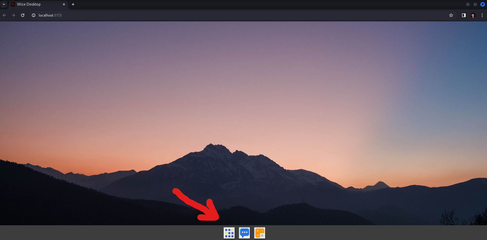
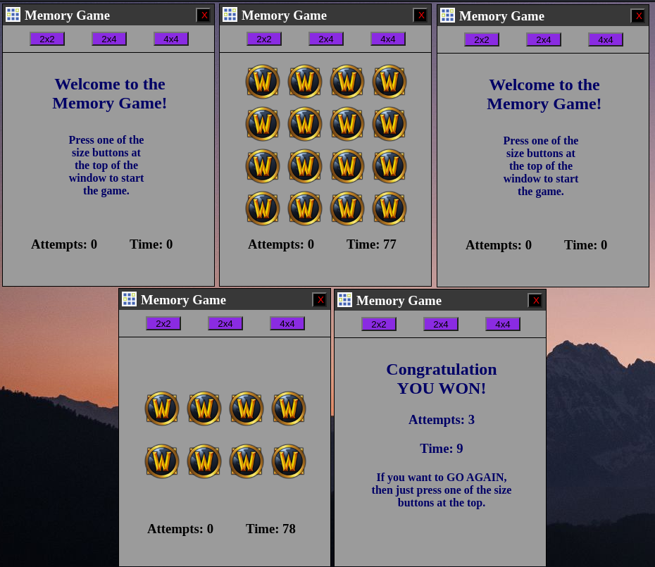
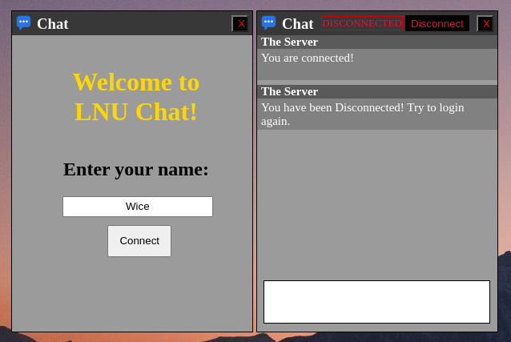
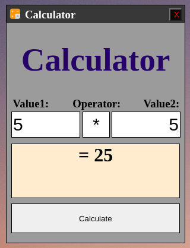
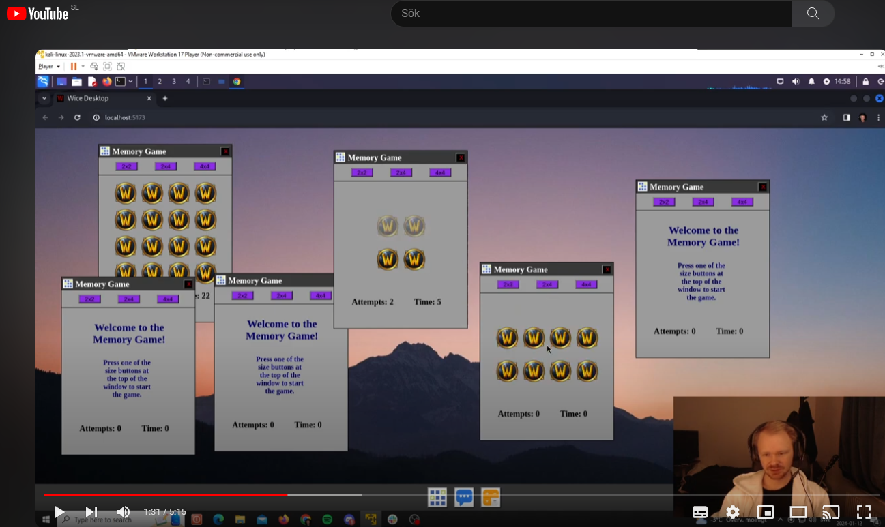

# A3 SPA

## Running the application:
CD into the README.md directory
Run the following two commands to start the application:

"npm install"
"npm run http-server dist" or "npm run serve"
It's also possible to run "npm run dev" for a live updater.

Then just go into the link that is represented on the screen.

## The Desktop:
 
The desktop contains 3 different applications:

## The Memory Game:
 
To be able to play the memory game, just press one of the sizes at the top of the window.

Then you can decide to either play the game with the mouse or with the keyboard. When you found two of the same, they will be removed from the game and shown with lower opacity. When all of the icons are of lower opacity, then the game is won.

Then to play a new game you can just press one of the different sizes at the top of the window again. You can also during a game, press the size buttons to reset the game.

## The Chat:
 
When startig the chat for the first time, you will have to ender a username. Then when you have entered the username, just press Connect. And that will connect you to LNU chat server. Once in the chat, you can see what others type and and you can type messages aswell by typing in the white box at the bottom. When you are done with your message, just press enter and it will be sent.

Once inside of the chat, you can also at any time press the "Disconnect button" to leave the chat, then you will have to enter a username again, to be able to get back to the chat.

## The Calculator:
 
The calculator is an application where you can calculate all types of numbers with 4 different operations  
"+, -, *, /"  
So just do as shown on the picture:
Enter a value in the value1 and value2 box, then type in any of the 4 different operators you want. And then last press calculate to calculate your numbers.

## Instruction Video:

