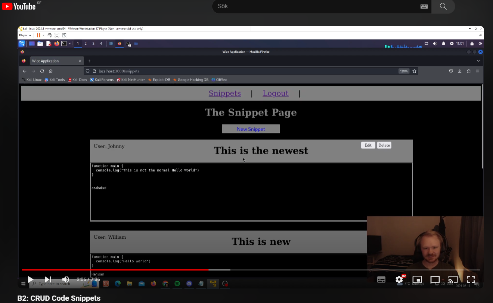

# B2 CRUD

## Starting Application Instructions:

### Step 1:
//Starts the docker in the backround.  
sudo docker-compose up -d  

### Step 2:
//Commands to run the server:  
npm install  
npm start

### Step 3:
//Webserver address:  
http://localhost:3000

## The Video:

