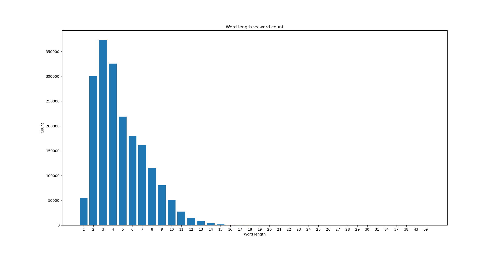
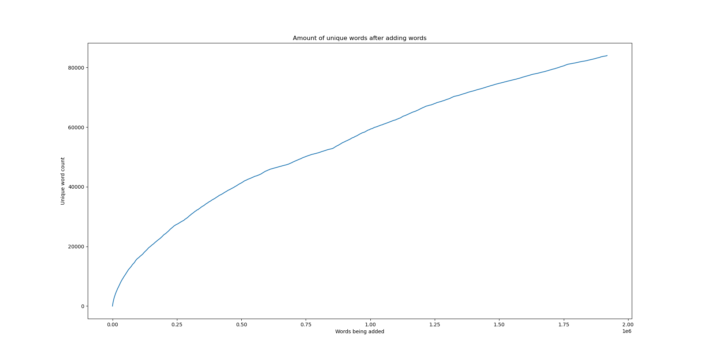

# Mini-project report 
Members: Ida Ryberg, Kseniya Rahouskay, Wictor Rindebrant, Erik Pirntke  
Program: Network Security  
Course: 1DV501  
Date of submission: 2021-11-04

## Introduction  

Mini Projektet är ett av fem delmoment i kursen 1DV501. Syftet med projektet är att få mer kunskaper om binära sökträd (BST) och Hashing och förstå hur de fungerar. Men även att kunna använda och arbeta med git och att kommunicera och samarbeta med varandra. 

Mini projektet består av fyra delar som presenteras längre ner.

1. Med hjälp av Pythons set räknades antalet unika ord i varje fil ut, och med hjälp av Pythons dictionary skapades en topp-tio-lista över de tio mest använda orden som har en längd större än fyra för båda filerna.
     
2. I andra delen skulle ett kodskelett fyllas ut baserat på binära sökträd (BST) map, och Hashing set.

3. I den tredje delen skulle första delen upprepas med de egna Hashset och BST mapen som kodades i del två. 
   
4. I den sista delen presenteras två olika grafer med hjälp av matplotlib library. Med hjälp av orden från eng_news_100K-sentences.txt räknas ut hur många ord av en given längd filen har med den BstMap som skapades i andra delen, och presenteras ett histogram "word length" vs "word count". Unika ord kontrolleras och samtidigt läggs till ord i HashSetet som skapades i del 2 och presenteras en graf "added words" vs "unique words".

## Part 1: Count unique words 1

| Files         | Words         | Unique  |
|:------------- |:-------------:| -------:|
| ``holy_grail``| 11215         |    1864 |
| ``eng_news``  | 1918499       |   84016 |

Till att börja med gjorde vi två funktioner.

Den första funktionen läste av orden i filen och la in dem i en lista.
```python
def file_to_lst(path):
    words = []
    with open(path, "r", encoding="utf-8") as file:
        for word in file:
            words.append(word.strip())
```

I den andra funktionen gjorde vi om listan med orden till en dictionary som angav hur många
gånger ett ord förekom i listan (som vi skickade in i funktionen). I dictionaryn där man lägger till orden så kommer key att vara ordet man lägger till och value kommer att vara antalet gånger ordet förekommer i listan. I funktionen så använder vi oss av en for-loop för att köra igenom alla orden i listan en efter en, en if-sats där den endast tar med ord med fler än fyra bokstäver och en till if-sats där den kollar om ordet redan finns med i dictionaryn. Om ordet inte finns med så skapas en dictionary för det ordet med value noll som sedan blir till ett innan den kollar nästa ord. Om ordet redan finns med i dictionaryn så lägger den till ett på värdet på det ordets dictionary och returnerade det.

```python
def occurrences_words(words):
    occurrences = {}
    for word in words:
        if len(word) > 4:
            if word not in occurrences:
                occurrences[word] = 0
            occurrences[word] += 1
```

Därefter så gjorde vi om dictionaryn med alla orden och hur många gånger dem förekom i listan ( som vi fick ifrån funktionen ``occurrences_words``) till en lista med tuples där alla tuples innehöll samma värden som i en dictionary (nyckel och värde). Vi gör detta då det inte går att sortera en dictionary. Vi sorterade sedan listan med tuples efter värdet (antalet gånger ordet förekom i listan) sedan vände vi om listan för att få de mest förekommande orden först i listan.Sedan använde vi en for-loop med en range på tio för att printa de tio första som även är de tio största.

```python
holy_items = list(holy_occ.items())
holy_sorted = sorted(holy_items, key=lambda tuples: tuples[1], reverse=True)

for i in range(10):
    print(f"{holy_sorted[i][0]:9} | {holy_sorted[i][1]}")
```

### ``Holy grail:``

| Words    |   | Count    |
|:---------|:-:|:--------:|
| arthur   | - | 261      |
| launcelot| - | 102      |
| knight   | - | 84       |
| galahad  | - | 81       |
| father   | - | 76       |
| bedevere | - | 68       |
| knights  | - | 65       |
| robin    | - | 58       |
| guard    | - | 58       |
| right    | - | 57       |

### ``Eng news:``

| Words       |  | Count      |
|:-----------:|:-:|:----------:|
| their       | - | 6144       |
| about       | - | 4606       |
| there       | - | 3931       |
| would       | - | 3877       |
| people      | - | 3803       |
| which       | - | 3573       |
| after       | - | 3016       |
| first       | - | 2890       |
| years       | - | 2809       |
| other       | - | 2748       |

## Part 2: Implementing data structures
   
Kraven för uppgift två var att använda sig av BST och hashset.
Funktion ``add()`` lägger till ord i en lista av listor beroende på ordets hash value som sedan bestämmer i vilken lista som ordet ska placeras i.

```python
def add(self, word):
    hash_value = self.get_hash(word)

    if word not in self.buckets[hash_value]:
        self.buckets[hash_value].append(word)
        self.size += 1
    
    if self.size == len(self.buckets):
            self.rehash()
```

Ordet som man skickar in i funktionen ``add()`` skickar först vidare ordet till en funktion som heter ``get_hash()`` för att få ett värde på ordet så att man sedan vet i vilken lista som ordet ska placeras i. Det som händer i funktionen ``get_hash()`` är att man först skickar in ett ord som man för varje bokstav i ordet beräknar asccii värdet på, sedan så lägger man ihopp alla dem värderna så att man får ut ett värde för hela ordet. Sen innan man returnar det så kör man modul på värdet med antal listor som finns i bucketen för att veta i vilken lista som just det ordet ska hamna i.

```python
def get_hash(self, word):
    var = 0
    for i in word:
        var += ord(i)
    hash_value = var % len(self.buckets)
    return hash_value
```

Om ordet som man skickar in till funktionen ``add()`` inte finns med i bucketen (i listan med ordets värde modulat med antal listor i bucketen) så lägger man till ordet i bucketen (i listan med ordets värde modulat med antal listor i bucketen) och plussar på 1 på varaibeln ``size`` så att man vet hur många element/ord som finns i bucketen. Om ordet redan finns med i bucketen så hoppar den bara över det ordet.

Om alla element/ord i listan är lika många som listor i bucketen så kallar man på en funktion som heter ``rehash()``. Funktionen rehash sparar alla element/ord ifrån bucketen till en variabel som heter ``old``. Sen så skriver man över sin bucket med en ny bucket som är dubbelt så stor ( Dem nya listorna kommer att vara helt tomma ), då den nya bucketen inte har några element/ord i sig så sätter vi även variabeln ``size`` till 0. Då vi vill ha våra gamla element/ord ifrån den gamla bucketen till den nya bucketen så måste vi köra alla dem orden i funktionen ``add()`` igen. Detta gör vi med hjälp av två for loopar som går igenom alla listor i bucketen och alla element/ord i listorna.

```python
def rehash(self):
    self.size = 0
    old = self.buckets

    self.buckets = [[] for i in range(len(self.buckets * 2))]

    for lst in old:
        for word in lst:
            HashSet.add(self, word)
```

### Funktion ``put()``:

Först och främst så skapas en root (första noden i trädet) med fyra olika variablar. ``Key`` som i detta fall är namnet, ``value`` som i detta fall är åldern och sedan ``left`` och ``right`` (som till en börja kommer att vara None).

```python
class Node:
    key: Any = None
    value: Any = None
    left: Any = None
    right: Any = None
```
```python
class BstMap:
    root: Node = None

    def put(self, key, value):
        if self.root is None:
            self.root = Node(key, value, None, None)
        else:
            self.root.put(key, value)
```

Om man vill lägga till en nod i trädet så kallar man på funktionen ``put()``. Funktionen fungerar på så sätt att man först kollar på den första noden om ``key`` är samma som ``key`` som man skickar in till funktionen. Om det är samma så skrivs nodens value över med value som man skickade in till funktionen. Om key inte är samma så jämför man om key av noden är större eller mindre än key som man skickade in i funktionen. Eftersom att key utgörs av namn så kommer värdet av keys ges av bokstäver där a är minsta värdet och z det största. Om det finns en node där man vill skapa en node så kör man om funktionen med samma key och value som man skickade in till funktionen men den här gånger jämför man med noden (som låg där man ville skapa en ny node) om nodens som man vill skapas key är större eller mindre än den nodens key. Detta gör man tills man hittar en plats i trädet som är tomt. När man hittar en tom platts där key (som man skickade in i funktionen) passar in så skapar man en node där med dem fyra variablarna.

### Funktion ``max_depth()``:

```python
def put(self, key, value):
        if key == self.key:
            self.value = value

        elif key < self.key:
            if self.left is None:
                self.left = Node(key, value, None, None)
            else:
                Node.put(self.left, key, value)

        elif key > self.key:
            if self.right is None:
                self.right = Node(key, value, None, None)
            else:
                Node.put(self.right, key, value)
```

För funktionen ``max_depth()`` så börjar man med att skapa två stycken variablar som vi tilldelar värdet 0. Det som händer därefter är att om det finns någon node till vänster om root noden så kommer funktionen att köra om funktionen tills den kommer längst ner åt vänster i trädet. När den har nått noden som är längst åt vänster med sin nästa node åt vänster som är None så kommer den att kolla om det finns en node till höger och om det är fallet så kommer den att gå in i noden som är åt höger och kolla om den har en vänster node. När man sedan kommer till en node som har sin vänster och höger som None så kommer den att lägga till ett på variablen ``max`` och sen börja röra sig uppåt i trädet och för varje node så lägger man till ett på ``max`` och kollar om det finns några nodes till höger, om det finns någon node till höger så går den in i den noden och kör om funktionen med den noden (Kollar vänster först tills den kommer till en node med höger och vänster som None). Varje gång som den har varit inne i en höger node så kommer den att jämföra hur långt ner i höger man har kommit åt det hållet jämfört med hur långt man har kommit åt vänster. Den som kommit längst ner av dem kommer att skriva över ``max`` med det värdet. Samma sak kommer att hända för alla nodes som är höger om root noden när den har kommit upp ifrån nodsen som är vänster om root noden. Och i slutändan så kommer variabeln ``max`` att vara värdet på hur långt ner noden som är längst ner i trädet är.

```python
def max_depth(self):
    left_depth = 0
    right_depth = 0

    if self.left:
        left_depth = self.left.max_depth()

    if self.right:
        right_depth = self.right.max_depth()

    max = left_depth
    if right_depth > max:
        max = right_depth

    return max + 1
```

## Part 3: Count unique words 2

Till att börja med importerade vi ``HashSet`` och ``BstMap`` från den tidigare uppgiften där vi konstruerade dem.

För att få fram topp-tio på uppgift tre så började vi med att importera ``BstMap`` filen som vi skrev i den tidigare uppgiften. Vi gör detta då vi ska använda oss av den dataklassen för att få fram topp-tio mest förekommande orden i dem två olika filerna som vi ska använda för denna uppgift (Holy_grail och Eng_news). Vi använder oss av dataklassen ``BstMap`` då vi inte får använda oss av dictionarys i denna uppgift för att få fram topp-tio mest förekommande orden i filerna.

Vi börjar med att göra om våra två filer till listor med ord som vi sedan sparar i två olika variabler.

```python
def file_to_lst(path):
    words = []
    with open(path, "r", encoding="utf-8") as file:
        for word in file:
            words.append(word.strip())
```

När vi har dem två filerna sparat som ord i listor så skickar vi in dem två listorna in till funktionen ``occurrences_words()`` en lista åt gången. Det som händer i funktionen är att man går igenom alla ord som finns i listan. För varje ord så kollar man först om ordet har fler än fyra bokstäver. Om ordet har fler än fyra bokstäver så skickar man in ordet i funktionen ``get()``. Den funktionen ger tillbaka värdet till den nyckeln. Om värdet till nyckeln är None, alltså itne finns med i trädet så skickar man in det ordet med värdet 0 till funktionen ``put()`` som lägger till ordet i trädet. Efter den har gjort det så kommer den att köra funktionen ``get()`` igen. Och i detta fall så kommer den att returna värdet som det ordet man skickar in i funktionen har och lägger till ett på det valuet som man får tillbaka. Sedan så skickar man in ordet i funktionen ``put()`` igen, men eftersom att ordet redan finns med i trädet så kommer den bara att skriva över det värdet med det nya värdet som man skickar in till funktionen. Detta upprepas för varje ord. På så sätt kommer vi få ett träd med alla orden och med ett value med hur många gånger som orden förekommer i listan som vi skickar in alla orden ifrån. Efter alla orden har körts så kommer man att kalla på funktionen ``as_list()`` som kommer att ta alla orden ifrån trädet och göra om dem till en stor lista med tuples för alla orden och deras värde. Den listan returneras sedan ifrån funktionen och sparas i en variabel.

```python
def occurrences_words(words):
    occurrences = bmap.BstMap()

    for word in words:
        if len(word) > 4:
            if occurrences.get(word) is None:
                occurrences.put(word, 0)
            value = occurrences.get(word) + 1
            occurrences.put(word, value)
    
    return occurrences.as_list()
```

Sedan så tar man listorna med tuples som innehåller alla orden och deras värden (hur många gånger dem förekommer i listan) och sorterar med hjälp av lambda som går in i listan och kollar på tuples värden och sorterar dem efter andra värdet som i detta fall är hur ofta orden förekommer. Sedan så vänder man på listan så att dem orden som förekommer flest gånger kommer först i listan.

```python
holy_sorted = sorted(holy_occurr, key=lambda tuples: tuples[1], reverse=True)
news_sorted = sorted(news_occurr, key=lambda tuples: tuples[1], reverse=True)
```

Till sist så printar man ut dem tio första orden i listan med sina values som man sorterat i tidigare kod. När man gör detta så kommer den att printa ut ordet och hur många gånger ordet förekommer.

```python
for i in range(10):
    print(f"{holy_sorted[i][0]:9} | {holy_sorted[i][1]}")
```

| Files         | Words         | Unique  |
|:------------- |:-------------:| -------:|
| ``holy_grail``| 11215         |    1864 |
| ``eng_news``  | 1918499       |   84016 |

### ``Holy grail``:

| Words    |   | Count    |
|:---------|:-:|:--------:|
| arthur   | - | 261      |
| launcelot| - | 102      |
| knight   | - | 84       |
| galahad  | - | 81       |
| father   | - | 76       |
| bedevere | - | 68       |
| knights  | - | 65       |
| robin    | - | 58       |
| guard    | - | 58       |
| right    | - | 57       |

### ``Eng news``:

| Words       |   | Count      |
|:-----------:|:-:|:----------:|
| their       | - | 6144       |
| about       | - | 4606       |
| there       | - | 3931       |
| would       | - | 3877       |
| people      | - | 3803       |
| which       | - | 3573       |
| after       | - | 3016       |
| first       | - | 2890       |
| years       | - | 2809       |
| other       | - | 2748       |

| Words from files         | Max bucket list | Max depth size  |
|:------------------------:|:---------------:|:---------------:|
| ``holy_grail & eng_news``|             305 |              44 |

## Part 4: Plotting

För den första delen av uppgiften använder man sig av orden man hade filtrerat ut ur ``eng_news_100K-sentences`` i den förra inlämningen. För att få ut orden ur filen läser man först in filen och går igenom varje rad av filen och sparar den i en lista. 
```python
path = # Path to file with words

words = []
with open(path, "r", encoding="utf-8") as file:
    for word in file:
        words.append(word.strip())
```
Efter att ha lagt in alla orden från filen in i listan har listan en längd av ungefär två miljoner element. Orden ur listan matas sedan in i den binära sökträd (bst) baserade dictionary genom att iterera över orden i listan. För värje ord anropas ``get`` funktionen av bst dictionary som går igenom dictionary och letar efter nyckeln som har angetts. Om nyckeln inte kan hittas returneras ``None`` och istället läggs nyckeln man letade efter in i dictionary med värdet noll med hjälp av ``put`` funktionen. ``Put`` funktionen går igenom det binära sökträdet och lägger nyckeln på rätt plats i trädet. Sedan anropas ``get`` funktionen igen utanför if-satsen och talet som returneras plussas på med ett och läggs in i dictionary igen med ``put``. Utanför for-iterationen returneras bst dictionary som en lista med hjälp av ``as_list`` funktionen. 
```python
occurrences = bst.BstMap()

for word in words:
    if occurrences.get(len(word)) is None:
        occurrences.put(len(word), 0)

    value = occurrences.get(len(word)) + 1
    occurrences.put(len(word), value)

occurrences = occurrences.as_list()
```
För att få nycklarna i storleksordning i listan sorteras den. Till sist delas nycklarna och värden upp i två listor för att visa upp det i en graf.
```python
occurrences = sorted(occurrences)
occ_keys = [n[0] for n in occurrences]
occ_values = [n[1] for n in occurrences]
```
Resultatet är rätt så förväntat då den genomsnittliga längden av engelska ord ligger runt fem bokstäver. Just i ``eng_news_100K-sentences`` är det ovanligt många ord med färre bokstäver dock så kan det såklart variera beroende på olika texter. Texten som användes i denna uppgift har totalt runt 190 tusen  ``the``, ``and`` och ``for`` i sig vilket får just den ordlängden förekomma som mest. Att antalet av ord med fler bokstäver än fem stadigt sjunker är mycket förväntat då det är mer ovanligt med längre ord.



Andra delen av uppgifften använder man sig även av orden man hade filtrerat ut ur ``eng_news_100K-sentences`` i den förra inlämningen och lägger in orden i en lista precis som i första delen av uppgiften. Sedan initialiseras set med ``init`` funktionen. Därefter iteras över alla ord i listan och för varje ord läggs ordet till i set med ``add`` funktionen om det inte redan har lagts till tidigare. Dessutom kollas storleken av set med ``get_size`` funktionen efter ett ord har lagts till. Det värdet läggs till i en lista för visa upp i en graf.
```python
set = hset.HashSet()
set.init()

set_size = []
for word in words:
    set.add(word)
    set_size.append(set.get_size())
```
Den linjära tillväxten av unika ord i grafen betyder att de unika orden är rätt så fördelade i texten vilket är förväntat. Anledningen till att antalet unika ord stiger snabbt i början är på grund av att dictionary är helt tom i början och orden i början av texten alla är unika. 



## Project conclusions and lessons learned

### Technical issues

- What were the major technical challanges as you see it? What parts were the hardest and most time consuming.
    * Dem svåraste delarna av projektet var att att arbeta med gitlab, det var mycket nya kommandon som man skulle lära sig och allt med branches och hur och vart man skulle pusha sina saker. Bortsätt ifrån gitlab så var uppgift 2 mest tidskrävande då det tog ett tag att förstå sig på hur Bst och Hash fungerade. Vi hade även problem med att få HashSet att sortera enligt det som visades i "facit" filen. Men när vi fick veta att den inte behövde sorteras på samma sätt som "facit" filen så var det inga konstigheter.

- What lessons have you learned? What should you have done differently if you now were facing a similar problem.
    * Om vi skulle stött på ett liknande problem i framtiden så skulle det varit bra att försöka förstå sig på hur gitlab fungerade innan vi började med projeketet. Skulle även varit bra att kolla i förväg vad man igentligen behöver få ut ifrån uppgifterna, som om HashSet verkligen behövde vara sorterat enligt "facit" filen tillexempelt.

- How could the results be improved if you were given a bit more time to complete the task.
    * Om vi hade fått mer tid med uppgiften så skulle vi hunnit göra alla uppgifterna. Vi hade nog även kunnat göra alla uppgifterna tillsammans istället för att behöva dela upp uppgifter/funktioner mellan gruppmedlemmar. Blev också lite stressigt i slutet av projektet då vi behövde skriva rapporten och presentationen samtidigt som vi hade en matte tenta. Så både rapporten och presentationen skulle vi nog kunnat göra mycket bättre om vi hade lite mer tid.

### Project issues

Vi hade ett grupprum på Discord som vi dagligen skrev med varandra på. Där bestämde vi även när och var vi skulle träffas för att tillsammans arbeta på uppgifterna. Vi träffades ungefär var tredje dag och gick igenom uppgifterna och hur långt vi hade kommit. Först tänkte vi att vi skulle dela upp uppgifterna mellan varandra, men på grund av att de byggde på varandra så bestämde vi oss istället för att dela upp varje uppgift i olika delar som vi sedan delade upp mellan oss. Efter att man hade skrivit klart en del kolla man med de andra hur långt de hade kommit och om de behövde hjälp med den delen som dem var på.

- Erik
	* Den största delen av första uppgiften skrev jag själv. Andra uppgiften delade vi upp mellan varandra. BstMap delen deleade Wictor och jag upp mellan varandra och jobbade ungefär lika mycket på den och hjälpte varandra på den. Tredje uppgiften skrev jag en liten del av som Wictor sedan färdigställde. Den sista uppgiften vi valde att göra var den fjärde som jag jobbade på helt själv. Förutom att jobba på uppgifter hjälpte jag även de andra gruppmedlemmarna med Git. Jag tog även om hand om vissa merge-requests. Jag tog dessutom över del fyra av rapporten och ändrade lite på den generellt. Tiden jag spenderade per vecka på miniprojektet låg på ungefär mellan 30 till 40 timmar.

- Kseniya
    * Förutom det jobbade jag med rapporten. Andra uppgiften jobbade jag mest på, jag tog över hela HashSet delen och implementerade alla funktioner i dataklassen till den. Förutom det bidrog jag till vissa delar av rapporten. Jag spenderade runt 30 timmar på projektet per vecka.

- Wictor
    * Den delen av miniprojektet som jag arbetade mest med var uppfigt 2    (BstMap) och uppgift 3. Men bortsätt ifrån dem två uppgifterna så var jag delaktig i alla dem 3 första uppgifterna. Jag gjorde så att det gick att köra alla dem tre första uppgifterna med båda filerna samtidigt, jag hjälpte även till med att förenkla kod där det beövdes och med att komma fram till så bra lösningar som möjligt på uppgifterna, hjälpte även till att skiva rent rapporten. Spenderade ungefär 30 till 40 timmar i veckan på projektet.

- Ida
	* Jag har främst varit ansvarig för rapporten, då jag hade lite mindre förståelse för programmering än gruppen så tog det längre tid för mig att lösa uppgifterna än vad det tog för dem andra vilket gjorde att vi samarbetade mycket med dem. I rapporten arbetade jag med introduktionen, part ett, två och tre samt powerpointen. Jag spenderade runt 20 timmar på projektet per vecka.

Vi lärde oss hur man ska jobba med Git som grupp. I efterhand hade vi strukturerat om sättet vi jobbade med Git på, speciellt med merge och hu rofta man ska merga. Dessutom lärde vi oss mycket om hur man skriver mer avancerade  dataklasser med ett stort antal funktioner. Dessutom borde vi ha börjat skriva rapporten lite tidigare, kanske till och med direkt efter en uppgift var färdig.
